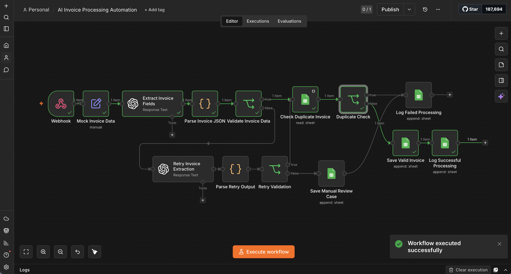
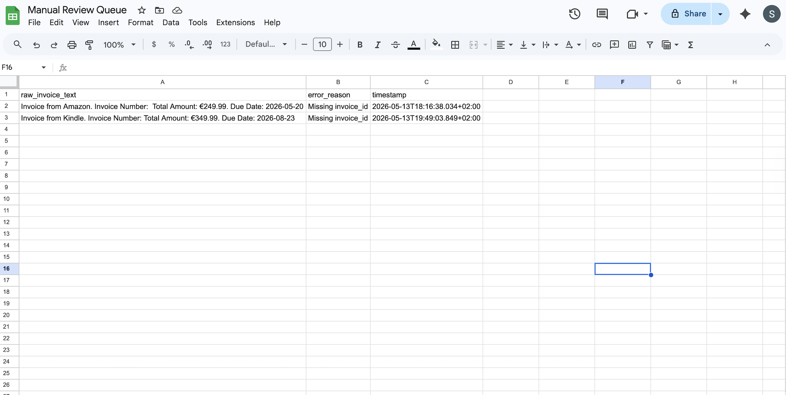
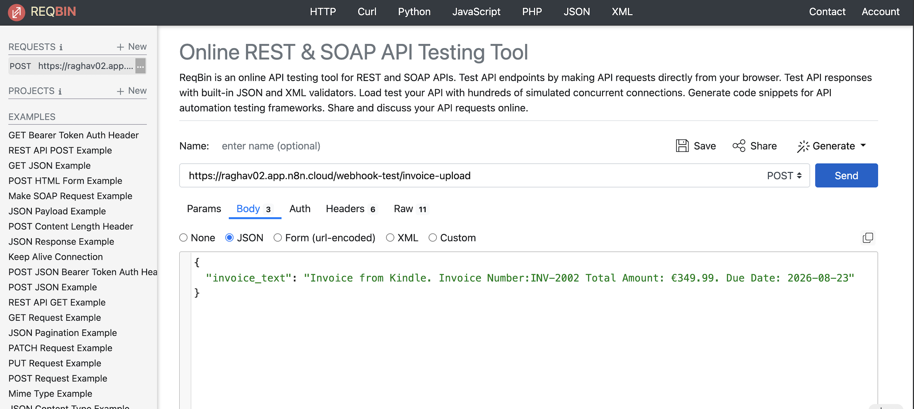

# AI Invoice Processing & Workflow Automation using n8n

## Overview

This project demonstrates an AI-powered invoice processing automation workflow built using n8n and OpenAI APIs.

The workflow automates structured invoice data extraction, validation, duplicate detection, retry handling, and operational logging through an event-driven pipeline.

The system simulates production-style automation workflows commonly used in operations and back-office process automation systems.

---

## Features

- Webhook-based invoice ingestion
- AI-powered invoice field extraction
- Structured JSON parsing
- Invoice validation logic
- Duplicate invoice detection
- Retry handling for failed extractions
- Manual review queue for unresolved cases
- Google Sheets integration for storage and logging
- Workflow execution monitoring
- Event-driven automation pipeline

---

## Tech Stack

- n8n
- OpenAI GPT-4o-mini
- Google Sheets API
- Webhooks
- JSON Parsing
- JavaScript (n8n Function Nodes)

---

## Workflow Architecture



---

## Execution Flow

1. Invoice data is received through a webhook trigger.
2. AI extraction node processes invoice text using OpenAI.
3. Structured JSON output is parsed and validated.
4. Duplicate invoice detection is performed using Google Sheets lookup.
5. Valid invoices are stored in Google Sheets.
6. Failed extractions trigger retry logic.
7. Unresolved failures are routed to a manual review queue.
8. Workflow execution logs are maintained for monitoring and debugging.

---

## Sample Input

```json
{
  "invoice_text": "Invoice from Amazon. Invoice Number: INV-2031. Total Amount: €249.99. Due Date: 2026-05-20"
}
```

---

## Sample Output

```json
{
  "vendor": "Amazon",
  "invoice_id": "INV-2031",
  "amount": "€249.99",
  "due_date": "2026-05-20"
}
```

---

## Retry & Error Handling

The workflow includes retry handling for failed AI extraction attempts.

If invoice validation still fails after retry processing, the workflow routes the invoice to a manual review queue for operational inspection.

---

## Monitoring & Logging

Workflow execution logs are maintained using Google Sheets for:

- processing status
- execution timestamps
- duplicate detection
- manual review tracking
- error monitoring

---

## Screenshots

### Workflow Execution


### Manual Review Queue



### Webhook Testing



---

## Workflow Export

The exported n8n workflow JSON file is available inside:

```bash
workflow/ai-invoice-processing-workflow.json
```

---

## Future Improvements

- PDF OCR integration
- Slack/email notifications
- Airtable/Notion integration
- Queue-based scaling
- Multi-document processing
- Cloud deployment support

---

## Project Purpose

This project was built to simulate production-style operational automation workflows and improve automation reliability using AI-assisted document processing pipelines.

It was designed as a hands-on learning project focused on workflow orchestration, validation logic, retry handling, and operational monitoring.
